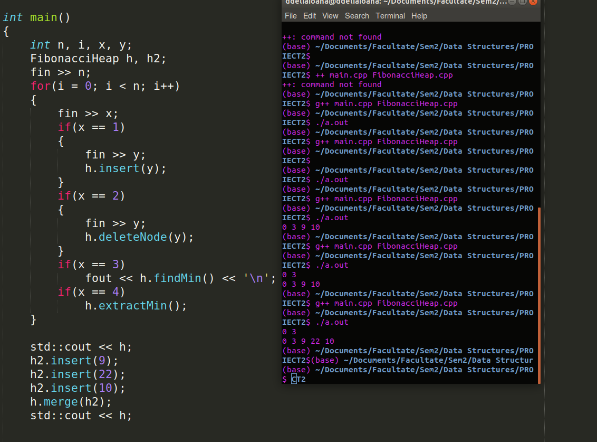

# Project 2: Fibonacci Heaps

- Implementation of **Fibonacci Heaps** using a class

## Operations

  - [x] **Build** empty heap
```cpp
FibonacciHeap h;
```
  - [x] **Insert** value in heap
```cpp
h.insert(1);
```
  - [x] **Find min** value in heap
  ```cpp
std::cout << h.findMin();
```
  - [x] **Extract(delete) min** value in heap
  ```cpp
h.extractMin();
```
  - [x] **Merge** 2 heaps
  ```cpp
h.merge(h2);
```
  - [x] **Consolidate** heap (including link operation) 
  ```cpp
consolidate();
```
  - [x] **Delete** node by value (lazy delete)
  ```cpp
h.deleteNode(1);
```

## Input format (date.in)
10      => number of operations <br>
**1** 5   => operation 1 ~ insert node 5 <br>
1 3 <br>
1 7 <br>
1 9 <br>
1 2 <br>
**3**       => operation 3 ~ find min <br>
**4**       => operation 4 ~ extract min <br>
3 <br>
1 0 <br>
3 <br>

## Output format (date.out)
2    (find min result) <br>
3    (find min result) <br>
0    (find min result) <br>
0 3  (roots of heap after completing all operations)

###### Merge example: Merging heap h (resulted from above input) with roots 0 3 with heap h2 with roots 9 22 10


