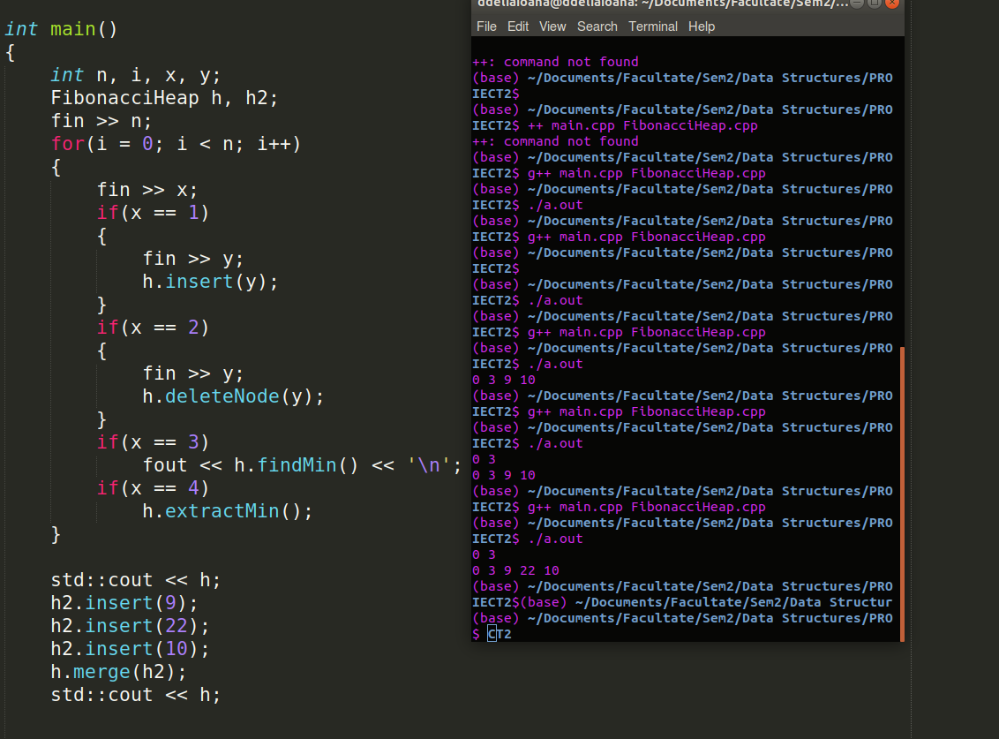

# Project 2: Fibonacci Heaps

- Implementation of **Fibonacci Heaps** using a class

## Operations

  - [x] **Build** empty heap
  - [x] **Insert** value in heap
  - [x] **Find min** value in heap
  - [x] **Extract(delete) min** value in heap
  - [x] **Merge** 2 heaps
  - [x] **Consolidate** heap (including link operation) 
  - [x] **Delete** node by value (lazy delete)

## Input format
10      => number of operations  
**1** 5   => operation 1 ~ insert node 5  
1 3  
1 7  
1 9  
1 2  
**3**       => operation 3 ~ find min  
**4**       => operation 4 ~ extract min  
3  
1 0  
3  

###### Merge example: Mergin heap h with roots 0 3 with heap h2 with roots 9 22 10

