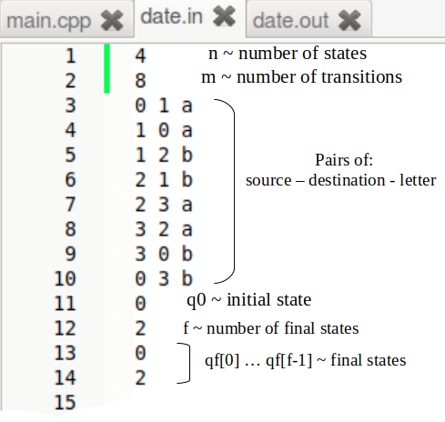
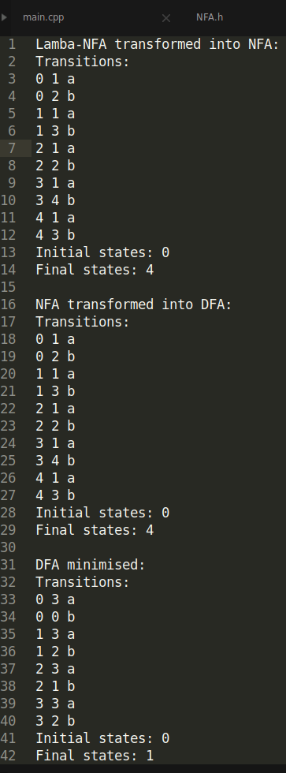

# Project 2

- Converting a **Lambda-NFA to a minimal DFA** in 3 steps, using class NFA and class DFA:

## Lambda-NFA to NFA

```cpp
NFA nfa;
nfa.removeLambdaTransitions();
```

## NFA to DFA
```cpp
NFA nfa;
DFA dfa(nfa);
```

## DFA to minimal DFA
```cpp
DFA dfa;
dfa.minimize();
```
## Input format 
- Same as Project 1; Lambda-transitions are represented using **#** <br>


## Output format

