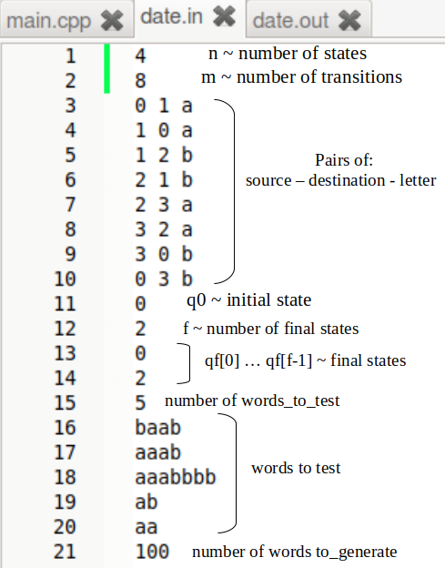

# Project 1

## DFA

- Given a Deterministic Finite Automaton, the program checks whether it accepts a certain word or not

## NFA

- Given a Nondeterministic Finite Automaton, the program checks whether it accepts a certain word or not

## FIRST ... WORDS GENERATED

- Given a number, the program generates the first *number* words generated by the automaton

## Input Format

