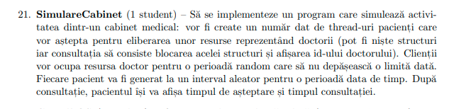
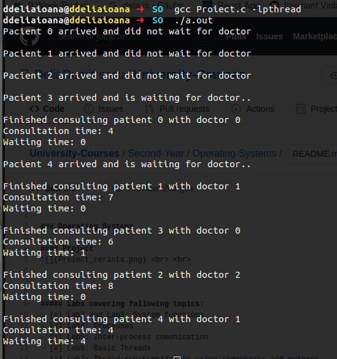

### Operating Systems 

#### Project
- [x] Requirements:

- [x] Concepts: implemented a **thread pool** using _threads, mutexes_ and _condition variables_

- [x] Execution: 

    

#### Labs covering following topics:
- [x] Lab2 and Lab3: System functions
- [x] Lab4: Processes
- [x] Lab5: Inter-process comunication
- [x] Lab6: Basic Threads
- [x] Lab7: Thread synchronization using semaphores and mutexes
