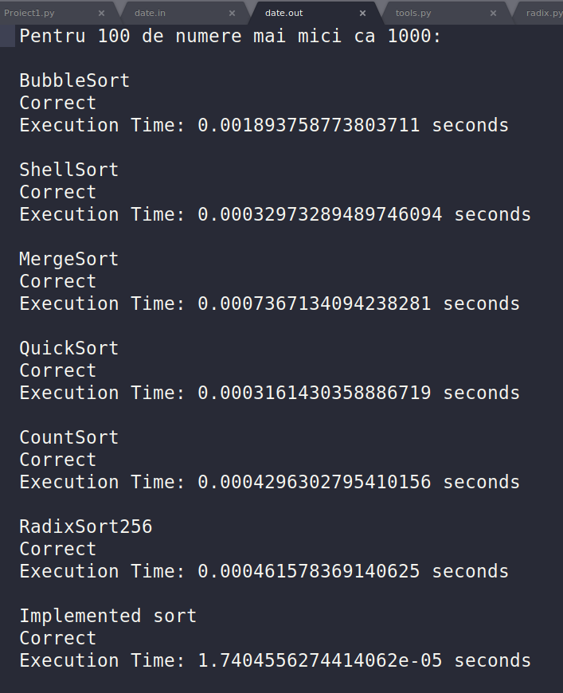

# Learning-Data-Structures
- Implementing various **sorting techniques**:
    * Count Sort
    * Radix Sort
    * Merge Sort
    * Quick Sort
    * Bubble Sort
    * Shell Sort
- Measuring execution time, including the execution time for the *Implemented Sort* in Python
- Testing on different inputs

## Input Format

number_of_tests  
number_of_elements_in_array &nbsp  limit_of_numbers_in_array

## Output Format

- Output generated for the first set of input:

